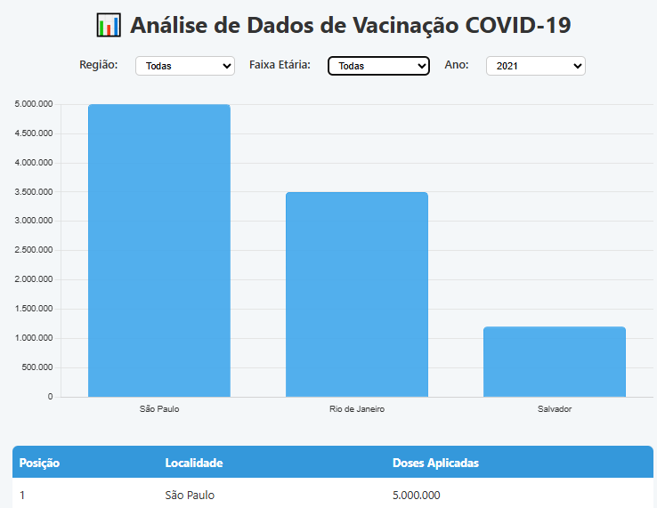
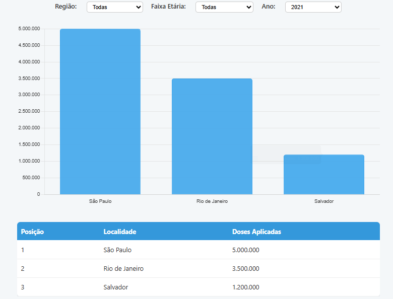
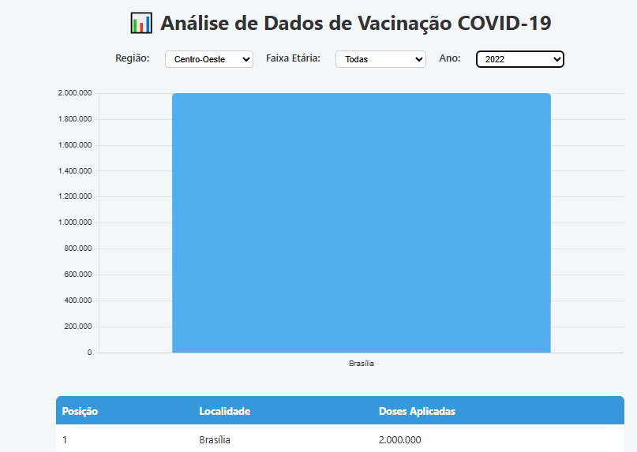
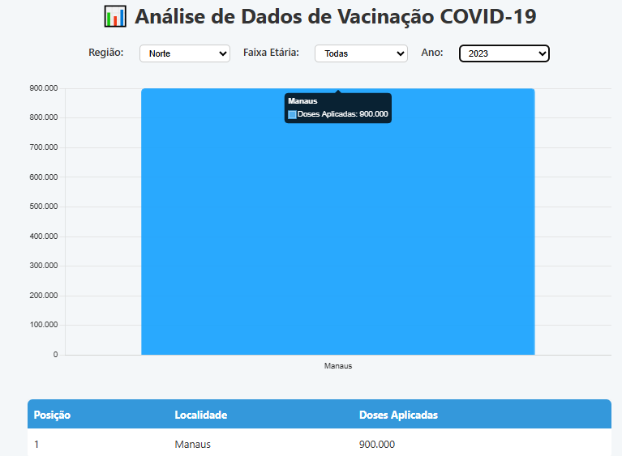

<<<<<<< HEAD
# 💉 Análise de Dados de Vacinação COVID-19

Projeto web que apresenta uma análise interativa dos dados de vacinação contra COVID-19 no Brasil.  
Inclui gráficos de doses aplicadas por estado/cidade, tabela de ranking dos locais mais vacinados e filtros por região, faixa etária e ano.

---

## 🚀 Tecnologias Utilizadas

- **HTML5** – Estrutura da página  
- **CSS3** – Estilização moderna e responsiva  
- **JavaScript** – Manipulação dinâmica dos dados e interatividade  
- **Chart.js** – Biblioteca para gráficos  

---

## 📊 Funcionalidades

- Gráfico de barras mostrando doses aplicadas por localidade  
- Tabela ordenada com ranking dos locais mais vacinados  
- Filtros para selecionar região, faixa etária e ano  
- Uso de dados locais com possibilidade de integração futura com API oficial  

---

## 📸 Visualização do Projeto

### Visão geral do dashboard  

### Gráfico de doses aplicadas por estado  

### Tabela de ranking dos locais mais vacinados  

### Filtros por região, faixa etária e ano  

---

## 📌 Autor

Desenvolvido por [Eduardo Martins](https://github.com/Eduuh007)  
[LinkedIn](https://www.linkedin.com/in/eduardo-martins-575521245)
=======
# analise-vacinacao-covid
Análise interativa dos dados de vacinação contra COVID-19 no Brasil, com gráficos, tabelas e filtros dinâmicos. Projeto feito com HTML, CSS, JavaScript e Chart.js.
>>>>>>> b8e7089183033f3fc613265418def47971673201
